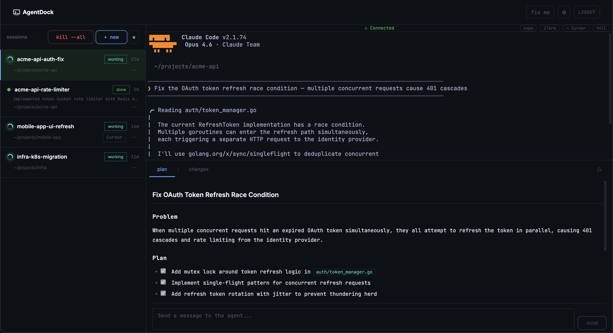
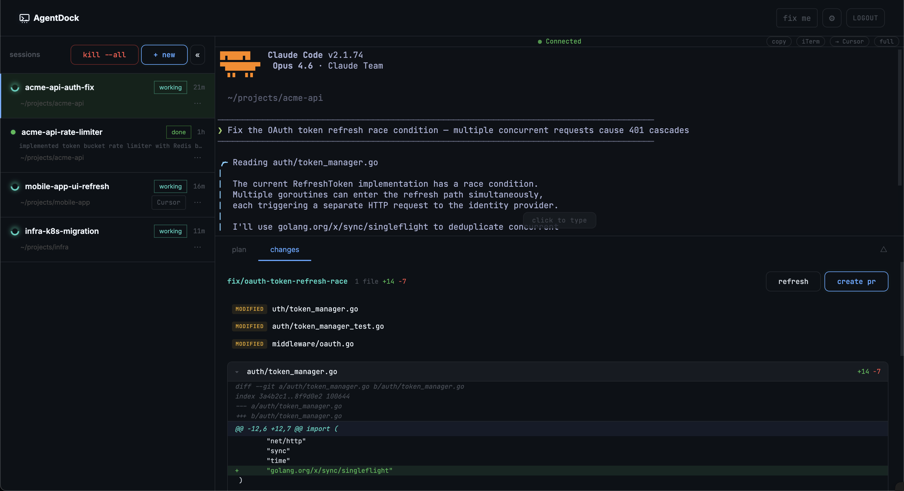
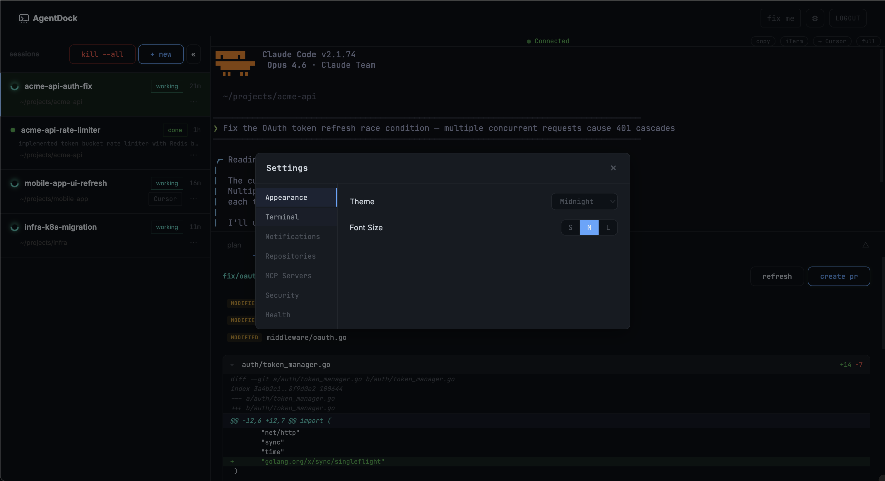

# agentdock

A web dashboard for managing parallel AI coding agents across multiple repositories. Run [Claude Code](https://docs.anthropic.com/en/docs/claude-code), [Cursor Agent](https://docs.cursor.com/agent), or other agents side-by-side in tmux sessions with git worktree isolation — all from your browser.

Create sessions, watch live terminal output, type input, switch between agents mid-conversation, spawn sub-agents, and manage everything through a clean web UI or CLI.

### Plan Tab


### Changes Tab


### Settings


## Features

- **Multi-agent support** — Claude Code, Cursor Agent, or add your own (see [AGENTS.md](./AGENTS.md))
- **Agent switching** — Switch between agents mid-conversation with context preservation
- **Sub-agents** — Agents can spawn child agents for parallel workstreams
- **Git worktrees** — Isolate work with automatic worktree creation per session
- **Multi-repo sessions** — Work across multiple repositories in a single grouped session
- **Live terminal** — Stream agent output in real-time via WebSocket + xterm.js
- **Session restore** — Restore stopped sessions with full conversation history intact
- **Plan tab** — Agents save structured plans; send follow-up messages directly from the plan view
- **Changes tab** — Live git diff viewer with inline commenting
- **Files explorer** — Browse and open files from the session's repo with in-file search (Cmd+F)
- **Status detection** — Real-time working/waiting/done status via Claude Code hooks
- **Prompt templates** — Save and reuse common prompts across sessions
- **Session grouping** — Organize sessions by project or team
- **Session pinning** — Pin important sessions to the top of the list
- **Meta-properties** — Attach custom key-value properties to sessions for context
- **Quick actions** — Fix-me button and Slack-to-fix for one-click session creation from issues
- **Ngrok integration** — Expose the dashboard over the internet with a single toggle
- **Keyboard shortcuts** — MRU session switcher, fullscreen terminal, and more
- **Collapsible sidebar** — Maximize terminal space with one click
- **Mobile-friendly UI** — Manage agents from your phone or tablet
- **Browser notifications** — Get notified when agents finish or need input
- **Password protection** — Optional authentication for network access

## Quickstart

### Prerequisites

- [Bun](https://bun.sh/) (runtime)
- [tmux](https://github.com/tmux/tmux) (session management)
- [git](https://git-scm.com/) (worktrees)
- At least one agent CLI: [Claude Code](https://docs.anthropic.com/en/docs/claude-code) or [Cursor Agent](https://docs.cursor.com/agent)

### Install

```bash
git clone https://github.com/vishalnarkhede/agentdock.git
cd agentdock
./setup.sh
```

This installs dependencies and installs the `agentdock` CLI to `~/bin`.

### Run

**Web dashboard:**

```bash
agentdock web
```

Opens http://localhost:5173 with the API server on port 4800.

On first launch, the setup wizard will prompt you to:
1. Set your **base path** (the directory where your repos live, e.g. `~/projects`)
2. **Auto-discover** git repositories in that directory
3. **Select** which repos to add

You can also add, remove, or scan for repos later in **Settings > Repositories**.

**CLI:**

```bash
agentdock start my-repo                # launch agent in a repo
agentdock start -r repo1 repo2         # grouped multi-repo session
agentdock start my-repo --isolated     # isolated git worktree
agentdock repos                        # list configured repos
agentdock list                         # show active sessions
agentdock stop --all                   # kill all sessions
```

## Configuration

All configuration lives in `~/.config/agentdock/`. No database required.

### Repos

Repos are configured on first launch via the setup wizard, or anytime through the web UI at **Settings > Repositories**. From there you can:

- **Scan** a directory to auto-discover git repos
- **Add** repos manually by alias and path
- **Remove** repos you no longer need

Alternatively, create `~/.config/agentdock/repos.json` directly:

```json
[
  { "alias": "backend", "folder": "my-backend", "remote": "org/my-backend" },
  { "alias": "frontend", "folder": "my-frontend", "remote": "org/my-frontend" }
]
```

Repos are expected under a base directory (default: `~/projects`). Override with:

```bash
export AGENTDOCK_BASE_PATH="$HOME/code"
```

### Optional Configuration

| Config file | Purpose |
|---|---|
| `~/.config/agentdock/auth-password` | Protect the web UI with a password |

MCP servers (e.g., [Linear MCP](https://github.com/linear/linear-mcp)) can be added via **Settings > MCP Servers** in the web UI and are automatically synced to all agent configs.

### Recommended: Session Persistence

[Cortex](https://github.com/hjertefolger/cortex) adds persistent local memory to Claude Code sessions. It automatically archives context to a local SQLite database and enables cross-session recall using hybrid semantic + keyword search. Works seamlessly inside agentdock sessions — install it in your Claude Code MCP config and memories will persist across session restarts, compactions, and token limit resets.

## How It Works

1. **Create a session** — pick repos, choose an agent (Claude or Cursor), optionally enable worktree isolation
2. **Agent launches** in a tmux session with appropriate permissions for file edits, git, and GitHub CLI
3. **Status is tracked** via Claude Code lifecycle hooks (`PreToolUse`, `Stop`, `Notification`, etc.) that write to `/tmp/agentdock-status/` — no terminal scraping needed
4. **Watch live output** — the terminal view streams `tmux capture-pane` over WebSocket at ~200ms intervals
5. **Type input** — keystrokes are forwarded to the tmux pane via `tmux send-keys`
6. **View the plan** — agents save structured plans to `~/.config/agentdock/plans/` which appear in the Plan tab; send follow-up messages directly from there
7. **Browse changes** — the Changes tab shows a live git diff of all modified files
8. **Switch agents** — seamlessly switch between Claude and Cursor while preserving conversation context
9. **Sub-agents** — agents can spawn child agents using the `ad-agent` CLI for parallel work
10. **Restore** — stopped sessions can be restored with full Claude conversation history, bypassing the interactive picker for reliability
11. **Stop** — kills the tmux session and cleans up any worktrees

## Keyboard Shortcuts

| Shortcut | Action |
|---|---|
| `Ctrl+Shift+[` / `Ctrl+Shift+]` | Switch to previous/next session (MRU order) |
| `Cmd+F` | In-file search (when Files tab is open) |
| `Esc` | Collapse plan/changes/files panel |
| Fullscreen button | Expand terminal to full window |

## Architecture

```
agentdock/
  bin/
    agentdock             # CLI tool
    ad-agent              # Sub-agent spawner (used by agents)
  server/                 # Bun + Hono (port 4800)
    src/
      services/
        session-manager.ts    # Session lifecycle orchestration
        tmux.ts               # tmux command interface
        worktree.ts           # git worktree management
        status.ts             # Agent status detection (hooks + fallback)
        config.ts             # File-based configuration
        linear.ts             # Linear ticket fetching
        slack.ts              # Slack message fetching
        sub-agent-prompt.ts   # Sub-agent system prompt generation
      routes/
        sessions.ts           # Session CRUD + agent switching + sub-agents
        repos.ts              # Repository management
        ws.ts                 # WebSocket terminal streaming
        git.ts                # Git diff / branch / PR operations
        tickets.ts            # Ticket context fetching
        quick.ts              # Quick actions (fix-me, Slack-to-fix)
        ngrok.ts              # Ngrok tunnel management
  client/                 # React + Vite + xterm.js (port 5173)
    src/
      pages/
        Dashboard.tsx         # Split-panel: session list + terminal/plan/changes/files
        CreateSession.tsx     # New session form with repo search + templates
      components/
        TerminalView.tsx      # xterm.js + WebSocket streaming
        ChangesView.tsx       # Git diff viewer with inline commenting
        FileExplorer.tsx      # File browser with in-file search
        SubAgentsView.tsx     # Sub-agent monitoring
        Header.tsx            # Quick actions, ngrok, session controls
```

## Adding a New Agent

agentdock is designed to support any CLI-based coding agent. See [AGENTS.md](./AGENTS.md) for step-by-step instructions on adding a new agent (e.g., Codex, Aider, Copilot CLI).

## Security

- **Local-first** — server binds to `localhost` by default
- **No external dependencies** — all data stored in local files, no database or cloud services
- **Optional auth** — password protection via hashed tokens stored in `~/.config/agentdock/password`
- **Agent isolation** — each session runs in its own tmux session with configurable tool permissions

For security issues, please see [SECURITY.md](./SECURITY.md).

## Platform Support

| Platform | Status |
|---|---|
| macOS | Fully supported |
| Linux (Ubuntu/Debian) | Fully supported |
| Windows | Via WSL only (tmux requirement) |

## FAQ

**Why tmux?**
tmux provides reliable process management, session persistence, and terminal capture without reinventing process supervision. It's battle-tested and available everywhere.

**Why Bun?**
Fast startup, built-in TypeScript support, and native WebSocket handling. The server starts in under 100ms.

**Why no database?**
Session state is ephemeral (tmux sessions) and configuration is simple (a few JSON/text files). A database would add complexity without benefit.

**Can I run this on a remote server?**
Yes — set a password in `~/.config/agentdock/password` and access the UI over your network. Use the built-in ngrok integration for a quick public URL, or set up SSH tunneling / a reverse proxy with HTTPS for a permanent setup.

**How does status detection work?**
Claude Code sessions use lifecycle hooks (`PreToolUse`, `Stop`, `Notification`, `SubagentStop`) that write status files to `/tmp/agentdock-status/`. This gives accurate working/waiting/done state without parsing terminal output. Cursor Agent uses terminal pattern matching as a fallback since it doesn't support hooks.

**How does session restore work?**
When a session is stopped (e.g. after a reboot), agentdock finds the most recent Claude conversation UUID from `~/.claude/projects/` and passes it directly to `claude --resume <uuid>`, bypassing Claude's interactive session picker entirely.

## Contributing

Contributions are welcome! See [CONTRIBUTING.md](./CONTRIBUTING.md) for development setup and guidelines.

## License

MIT — see [LICENSE](./LICENSE) for details.
